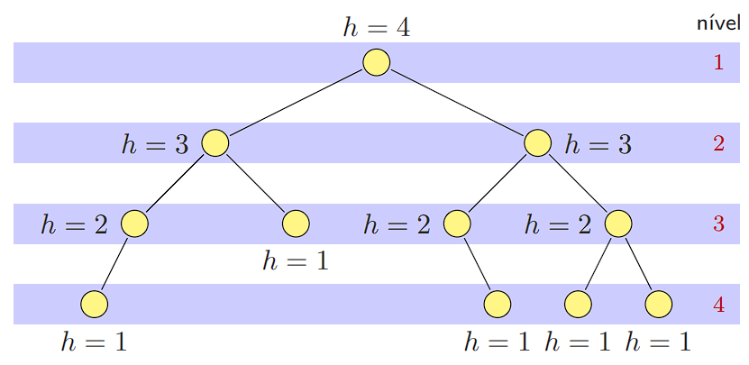
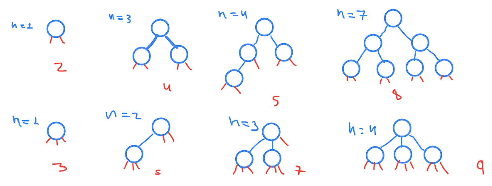
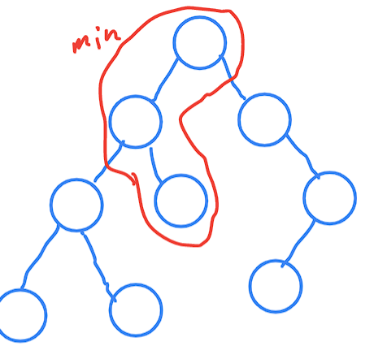

# EDA - Atividade 01

**Nome:** Henricky de Lima Monteiro

**Matrícula:** 475075

---------------
## Definições:

* **Profundidade / Nível** de um nó $v$: Número de nós no caminho de $v$ até a raiz. Dizemos que todos os nós com profundidade $i$ estão no nível $i$.

* **Altura** $h$ de um nó $v$: Número de nós no maior caminho de $v$ até uma folha
descendente.

* **Arvore binária completa**: possui a propriedade de que, se $v$ é um nó tal que alguma sub-árvore de $v$ é vazia, então $v$ se localiza ou no penultimo ou no ultimo nível da árvore.

-------------
1. **Se $v$ é o pai de um nó $w$ de uma árvore $T$, então:**
    * $nivel(v) = nivel(w) + 1$
        > Dado o fato que o nó raiz $a_0$ tem nível 1, $nivel(a_0) = 1$, então seus filhos $a_1$ e $a_2$ tem nível maior, ou seja, $nivel(a_1) = nivel(r)+1 = 2$, logo pela definição passada não bate com a desejada, pois nela, está dizendo que o nível do pai é o incremento do nível do filho, mas isso não é verdade. A definição mais precisa seria 
        $$nivel(w) = nivel(v)+1$$

    * $altura(v) = altura(w) + 1$
        > Neste caso, para $w$ sendo uma folha, ou seja, o caso onde não existe nós filhos. A altura de uma folha $a_0$ é $altura(a_0)=1$. Assim, um nó $a_1$ que é pai da folha $a_0$ tem altura $altura(a_1) = altura(a_0)+1$. Logo,

        $$altura(a_0) = 1 \\altura(a_1) =altura(a_0)+ 1 \Rightarrow \\ altura(a_i) = altura(a_{i+1})+1$$
        > Onde, $a_i$ é filho de $a_{i+1}$, ou seja, $w$ é filho de $v$ e  $altura(v) = altura(w) + 1$ é válida.
            
    * $max_{v\in T}\{altura(v)\} = max_{v\in T}\{nivel(v)\}$
        >Neste caso, temos que *"a altura maxima de um nó é igual ao nível máximo deste mesmo nó"*. Isso não é valido, pois, como vimos, a altura é calculada de baixo para cima, enquanto que, o nível é calculado de cima para baixo. Assim, pela image 1 podemos ver que o nível da raiz é 1 e a sua altura é 4, logo não é válido.

2. **Uma árvore m-ária $T$, $m\ge 2$, é um conjunto finito de elementos, denominados nós ou vértices, tais que**
    * (I) $T = \empty$ e a árvore é dita vazia, ou
    * (II) $T \neq \empty$ e $T$ contém um nó especial chamado de $T$, representado por $r(T)$, e os restantes ppodem ser sempre divididos em $m$ subconjuntos disjuntos, as i-ésimas subarvores de $r(T)$, $1 < i < m$, as quais são também árvores m-árias.
    * Prove que o número de subárvores vazias de uma árvore m-ária com $n>0$ nós é $(m-1)n+1$

    > Desta definição temos que o caso base sendo o mínimo de $m$ e o mínimo de $n$, ou seja, 2 e 1, respectivamente, ou seja, uma árvore binária de 1 nó, logo, uma arvore não vazia, que tem apenas sua raiz, tem duas subarvores. Assim,

    > **Caso Base:**
    $$f(m,n) = f(2,1) = 2 \\ f(2,2) = 3 \\ f(2,3) = 4 \\  f(2,4) = 5 \\ f(2,7) = 8\\ \Rightarrow  f(2,n) = n+1$$

    $$f(m,n) = f(3,1) = 3 \\ f(3,2) = 5 \\ f(3,3) = 7 \\  f(3,4) = 9\\ \Rightarrow  f(3,n) = 2n+1$$

    > seguindo essa linha teremos que para $f(4,n) = 3n+1$, logo no fim ficamos com
    $$f(m,n) = (m-1)n+1$$

    

    > Dai podemos,

    $$f(m,n) = f(2,n_0=1) = 2 \\ \rightarrow f(2,n_1=n_0+1) = n_0+1 \\ \Rightarrow f(2,n) = n+1$$

    $$f(m,n) = f(m_0=2,n) = n+1 \\ \rightarrow f(m_1 = m_0+1,n) = (2)n+1 \\ \rightarrow f(m_2 = m_1+1,n) = (3)n+1 \\ \Rightarrow $$
    $$f(m,n) = (m-1)n+1$$

3. **Uma árvore binária é completa se e somente se ela possuir altura mínima para um dado número de nós.**

    * Se é completa  $\Rightarrow$ possui altura mínima para n>0 nós.

    * Se possúi altura mínima para n>0 nós   $\nRightarrow$ é completa.
        > Nes caso, para a árvore de exemplo, possúi altura mínima, porém não é completa pela subarvore esqueda não estar na definição.

        
